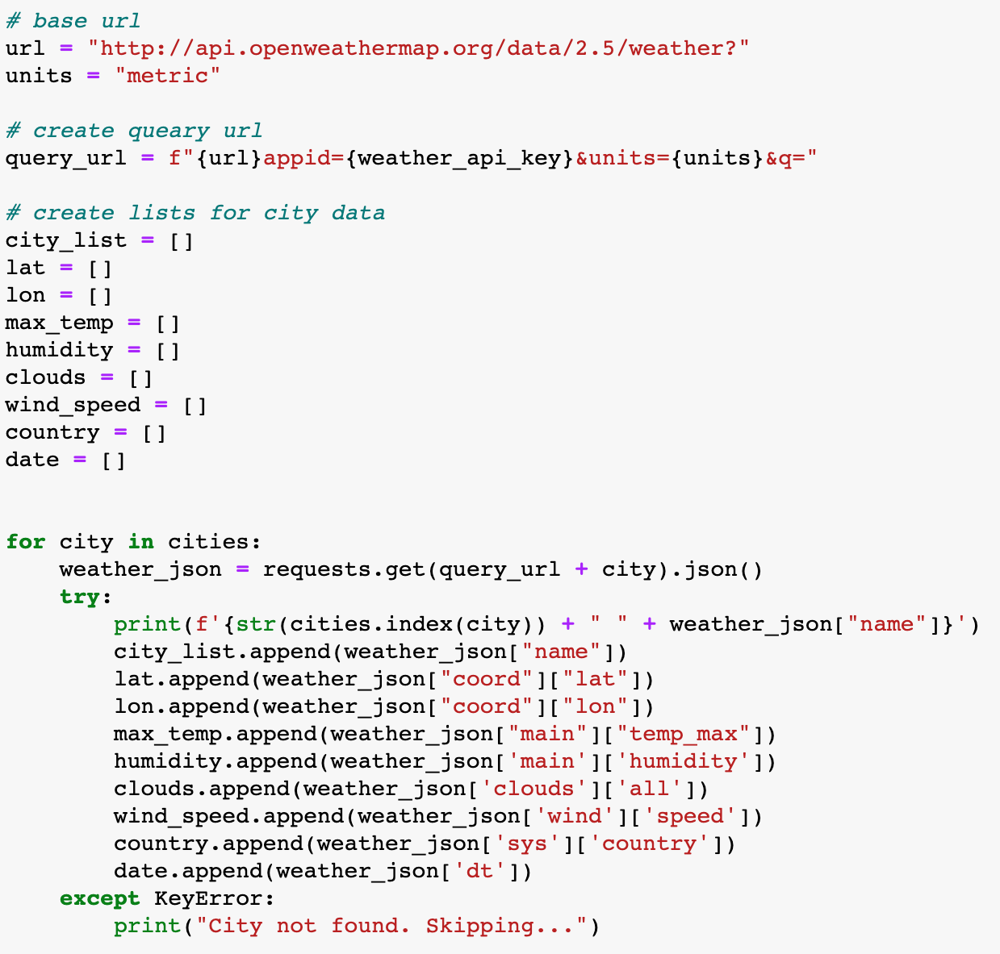

# API Weather Visualization with Python

I created a website that compares longitudinal observations of temperature, wind speed, humiditiy, and cloudiness, then I used all the data I collected to find the vacation spots with the perfect weather. 

Website hosted by github pages:
https://catherineluquire.github.io/API-Weather-Visualization/

* [Technologies](#technologies)
* [Data Sources](#data-sources)
* [Installation](#installation)
* [Development Process](#development-process)
* [Contact](#contact)

## Technologies
* Python
  * matplotlib
  * pandas
    * json-normalize
  * numpy
  * requests
  * time
  * pprint
  * json
  * scipy.stats 
    * linregress
  * citipy
  * gmaps
  * ipywidgets.embed 
    * embed_minimal_html
  * os
  

## Data Sources
* [Open Weather Map API](https://openweathermap.org/api)
* [Google Maps API](https://cloud.google.com/maps-platform/?utm_source=google&utm_medium=cpc&utm_campaign=FY18-Q2-global-demandgen-paidsearchonnetworkhouseads-cs-maps_contactsal_saf&utm_content=text-ad-none-none-DEV_c-CRE_460848633595-ADGP_Hybrid%20%7C%20AW%20SEM%20%7C%20BKWS%20~%20Google%20Maps%20API-KWID_43700035216023635-kwd-382406281820-userloc_9010328&utm_term=KW_%2Bgmap%20%2Bapi-ST_%2Bgmap%20%2Bapi&gclid=Cj0KCQiA5bz-BRD-ARIsABjT4ngcyoJ_2wiBRHuxe8cR-4hGtpREQNV74rXv8z3BsAfySa_Wr1-fZRoaApR5EALw_wcB)

## Installation and Usage
Create api_keys.py file within same directory as Jupyter Notebook files to store personal API keys. Within Jupyter Notebooks, from  api_keys import weather_api_key and import g_key.

## Development Process

### Weather API Calls and Data Cleaning
1. Use citypy and numpy to find cities closest to randomly generated latitude and longitude coordinates. Loop through cities, performing API calls and appending relevant data to empty lists.

## Contact
1. [Katy Luquire](https://github.com/CatherineLuquire)

