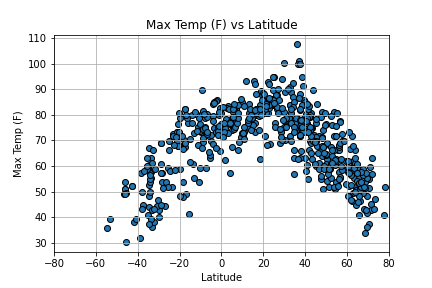

# API Weather Visualization with Python

I created a website that compares longitudinal observations of temperature, wind speed, humiditiy, and cloudiness, then used the data I collected to find the vacation spots with the perfect weather. 

Website hosted by github pages:
https://catherineluquire.github.io/API-Weather-Visualization/

* [Technologies](#technologies)
* [Data Sources](#data-sources)
* [Installation](#installation-and-usage)
* [Development Process](#development-process)
* [Contact](#contact)

## Technologies
* Python
  * matplotlib
  * pandas
    * json-normalize
  * numpy
  * requests
  * time
  * pprint
  * json
  * scipy.stats 
    * linregress
  * citipy
  * ipywidgets.embed 
    * embed_minimal_html
  * os
 * Gmaps
 * HTML/CSS
  * Bootstrap
 

## Data Sources
* [Open Weather Map API](https://openweathermap.org/api)
* [Google Maps API](https://cloud.google.com/maps-platform/?utm_source=google&utm_medium=cpc&utm_campaign=FY18-Q2-global-demandgen-paidsearchonnetworkhouseads-cs-maps_contactsal_saf&utm_content=text-ad-none-none-DEV_c-CRE_460848633595-ADGP_Hybrid%20%7C%20AW%20SEM%20%7C%20BKWS%20~%20Google%20Maps%20API-KWID_43700035216023635-kwd-382406281820-userloc_9010328&utm_term=KW_%2Bgmap%20%2Bapi-ST_%2Bgmap%20%2Bapi&gclid=Cj0KCQiA5bz-BRD-ARIsABjT4ngcyoJ_2wiBRHuxe8cR-4hGtpREQNV74rXv8z3BsAfySa_Wr1-fZRoaApR5EALw_wcB)

## Installation and Usage
Create api_keys.py file within same directory as Jupyter Notebook files to store personal API keys. Within Jupyter Notebooks, from  api_keys import weather_api_key and import g_key.

## Development Process
### Data Collection, Cleaning, and Visualizations
#### Weather API Calls and Data Cleaning
1. Use citypy and numpy to find cities closest to randomly generated latitude and longitude coordinates. Loop through cities, performing API calls and appending relevant data to empty lists.
2. Create a dictionary from the newly generated lists of data and convert to dataframe. Clean data to get it in workable condition.
3. Export dataframe to a CSV.

#### Weather Plotting
1. Import csv file from previous step and write function to create plots comparing latitude and weather measurements, and function to compare weather measurements by hemisphere and absolute latitude with linear regression.

#### Vacation Planning with Google Maps
1. Import csv file from step 1 into dataframe and use gmaps to create heatmap to visualize high humidity. Save map as figure. 

2. Clean dataframe to find cities with temperature between 70-80 degress, clear skies, windspeed less than 10mph, and less than 100% humidity. Loop through dataframe, performing API calls with gmaps to find hotels within 5000 meters of the geocoordinates and add to dataframe.
3. Use newly generated hotel info to add hotel markers to the heatmap containing hotel name, city, and country. Save map as figure. 

### Website Development

Use HTML, CSS, and bootstrap to build website using previously created charts and maps. Deploy via Github Pages. 

## Contact
1. [Katy Luquire](https://github.com/CatherineLuquire)

